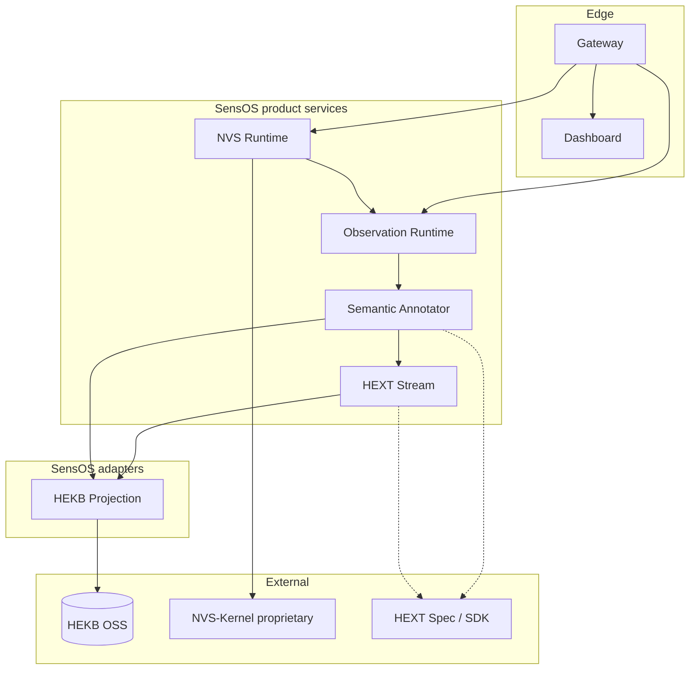

# SensOS Architecture

## Purpose

SensOS is the commercial integration product that connects observation, meaning,
knowledge, and application sessions on top of the HEXT AI ecosystem.

## Canonical data path

```text
Observation
    ↓
Semantic Annotator
    ↓
HEKB
    ↓
NVS Runtime
    ↓
Applications
```

### Layer responsibilities

| Stage | Component | What happens |
|-------|-----------|--------------|
| Observation | Observation Runtime (`services/observation-runtime`) | Ingest reality signals; curvature/entropy/memory modules; DAK gating |
| Meaning | Semantic Annotator + HEXT Stream | Annotate observations; stream HEXT semantic events |
| Knowledge | HEKB (external) via `integrations/hekb-projection` | Project / query knowledge objects |
| Execution | NVS Runtime | Agents, sessions, MCP tools, application orchestration |
| Edge | Gateway | Single public entry; routes to Dashboard / Runtime / health |
| Presentation | Dashboard | Operator UI surface |

Commercial proprietary core **NVS-Kernel** sits behind published ABI contracts in
`interfaces/nvs-kernel/`. Its implementation is not part of this repository.

## Component map



## Service communication

| From | To | Protocol | Notes |
|------|----|----------|-------|
| Gateway | NVS Runtime / Observation / Dashboard | HTTP | Path-based reverse proxy |
| NVS Runtime | Observation Runtime / NVS-Kernel | HTTP | Via `KernelGateway` |
| Observation Runtime | Semantic Annotator | HTTP | Meaning attachment |
| Semantic Annotator / Stream | HEKB Projection | HTTP | Knowledge write/query |
| HEXT Stream | Redis | Redis protocol | Backing store for stream |
| NVS Runtime | Clients / tools | MCP + REST | Application plane |

All product containers share the Compose network `sensos_net` (or the cluster
equivalent). Only Gateway (and optionally Dashboard via Gateway) should be
exposed publicly in production.

## Boundaries

### HEKB

- HEKB is an **external OSS dependency**
- This repository may contain **adapters / projection faces** only
- Do not vendor HEKB core sources or redefine HEKB types here

### HEXT

- HEXT specification and SDK remain upstream
- SensOS consumes HEXT through Annotator + Stream services
- Do not duplicate HEXT definition documents in product code

### NVS-Kernel

- Proprietary commercial core
- Source remains outside this product repository
- Publish and version only ABI / protobuf under `interfaces/`

## Deployment topology

Preferred: **one process per container**.

| Container | Image role |
|-----------|------------|
| `observation-runtime` | SensOS Observation Runtime |
| `semantic-annotator` | Annotator API |
| `hext-stream` | Semantic stream API |
| `hekb-projection` | HEKB face for SensOS |
| `nvs-runtime` | MCP / session runtime |
| `gateway` | Nginx edge |
| `dashboard` | Static operator UI |
| `redis` / `postgres` | Infrastructure dependencies |

See [`../deployment/compose.md`](../deployment/compose.md).

## Non-goals

- Research experiment harnesses
- Benchmark archives
- Monolithic “all-in-one” container
- Re-implementing HEKB or HEXT inside SensOS
