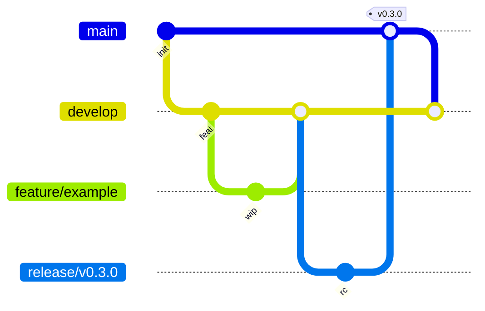

# Git Governance & Release Management

| Field | Value |
|-------|-------|
| Document | Git / Release Governance |
| Path | `docs/spec/GIT_GOVERNANCE.md` |
| Version | 1.0.0 |
| Status | Active |
| Constitution | `docs/spec/PRODUCT_BOUNDARY.md` v1.1.0 (higher authority) |
| Owner | Release Manager · Architecture Owner |

This document is the **operating contract** for Git branches, tags, commits, PRs, CI, and releases.  
It MUST NOT contradict the Product Constitution. On conflict, the Constitution prevails.

---

## 1. Branch Strategy

| Branch | Purpose | Merge from | Merge to | Protected |
|--------|---------|------------|----------|-----------|
| `main` | Stable / production-ready tip | `release/*`, `hotfix/*` | tags only via release | **Yes** |
| `develop` | Integration branch | `feature/*` | `release/*` | **Yes** |
| `feature/<scope>-<short>` | Feature work | local | `develop` (PR) | No |
| `release/vX.Y.Z` | Release hardening | `develop` | `main` + back-merge `develop` | Recommended |
| `hotfix/<short>` | Production fix | `main` | `main` + `develop` | Recommended |

### Naming examples

```text
feature/runtime-auth-docs
feature/hekb-mcp-tags
release/v0.3.0
hotfix/sensos-health-crash
```

### Rules

1. **No direct push to `main`.** PR required.
2. Prefer **no direct push to `develop`** (PR required when branch protection is enabled).
3. `feature/*` MUST target `develop` (not `main`), except documentation-only hotfixes approved by Release Manager.
4. `hotfix/*` MAY target `main` when fixing a released Stable/RC line.
5. Long-lived feature branches (>14 days) require Architecture Owner acknowledgment.



---

## 2. Tag Strategy

| Pattern | Meaning | Example |
|---------|---------|---------|
| `v0.x.y` | Pre-1.0 Product Platform (breaking changes allowed with notes) | `v0.3.0` |
| `v1.0.0` | First Stable Product Platform train | `v1.0.0` |
| `vX.Y.Z` | SemVer release of the **integrated product train** | `v1.2.0` |
| `vX.Y.Z-<unit>` | Optional per Release Unit tag | `v0.3.0-sensos`, `v0.1.0-hext` |
| `rfc/<id>@vN` | RFC freeze / acceptance marker | `rfc/nvs74@v1` |
| `adr/<id>` | Optional ADR acceptance marker (prefer commit + ADR status) | `adr/0004` |

### Rules

1. Release tags are **annotated** (`git tag -a vX.Y.Z -m "..."`).
2. Tags on `main` only for Stable/RC promotion (Alpha/Beta may tag `develop` or `release/*` with pre-release suffix).
3. Pre-release suffixes: `-alpha.N`, `-beta.N`, `-rc.N`.
4. Do not move/reuse tags after publication.
5. Image tags MUST match SemVer for Release Units (Constitution §9) — avoid undated `latest` on published releases.

---

## 3. Commit Convention

**Conventional Commits** (required on `develop` / `main` PRs):

```text
<type>(<scope>): <summary>

[optional body]

[optional footer]
```

### Types

| Type | Use |
|------|-----|
| `feat` | New Product/Platform capability |
| `fix` | Bug fix |
| `docs` | Documentation / ADR / RFC notes |
| `refactor` | Internal change without behavior change |
| `test` | Tests only |
| `ci` | CI/CD |
| `chore` | Maintenance (deps, ignore files) |
| `perf` | Performance |
| `revert` | Revert |

### Scopes (preferred)

`runtime` · `sensos` · `hekb` · `hekb_mcp` · `hext` · `annotator` · `auth` · `docker` · `adr` · `rfc` · `governance` · `legacy`

### Examples

```text
feat(runtime): add Product JWT auth module
fix(auth): preserve ObservationToken issuer claims
docs(adr): accept ADR-0004 hekb_mcp legacy detach
refactor(hekb): clarify projection health handlers
ci(governance): add product legacy import grep gate
```

### Footers

```text
BREAKING CHANGE: <description>
Refs: ADR-0004
Refs: PRODUCT_BOUNDARY §16
```

Breaking changes require Constitution §15.3 / ADR when architectural.

---

## 4. Pull Request Rules

### Required

1. PR against the correct base branch (`develop` / `main` / `release/*`).
2. **At least one approving review** (Architecture Owner or delegate for High-risk areas).
3. **CI must pass** (see §7).
4. Constitution PR checklist when layout/contracts change (PRODUCT_BOUNDARY §24).
5. Conventional Commit title (or squash message conforming).

### ADR update required when

- Product/Platform/Legacy classification changes → Constitution bump + ADR
- Active compose / Canonical Kernel / HEKB canonicalization changes
- Stable public interface / ABI break
- Detaching or reattaching major subsystems (see ADR-0004 pattern)

### PR template

Use `.github/pull_request_template.md`.

### Merge strategy

- Prefer **squash** for `feature/*` → `develop`
- Prefer **merge commit** or squash for `release/*` → `main` (Release Manager choice, consistent per train)

---

## 5. Release Train

| Stage | Branch tip | Tag suffix | Audience | Criteria |
|-------|------------|------------|----------|----------|
| **Alpha** | `develop` | `-alpha.N` | Internal | CI green; known gaps OK |
| **Beta** | `release/vX.Y.Z` | `-beta.N` | Friendly external | Release Unit smoke; no Critical defects |
| **RC** | `release/vX.Y.Z` | `-rc.N` | Pre-prod | Full CI + Certification workflow; freeze features |
| **Stable** | `main` | `vX.Y.Z` | Production | RC signed off; CHANGELOG finalized; images SemVer-tagged |

### Release Units on the train

Per Constitution §9: SensOS, MCP Runtime, HEXT, HEKB Projection, Semantic Annotator (+ HEKB MCP when published).

Platform libraries may ship coupled versions noted in CHANGELOG.

### Not on customer Release Train

`sensos-exp4000`, `sensos-certification` (Internal), Legacy `kernel/`, Research artifacts.

---

## 6. CHANGELOG

- File: repository root `CHANGELOG.md`
- Format: **[Keep a Changelog](https://keepachangelog.com/)** 
- Categories: `Added`, `Changed`, `Deprecated`, `Removed`, `Fixed`, `Security`
- Every Stable/RC tag MUST update CHANGELOG before tag
- Link versions to Git tags / compares when published on GitHub

---

## 7. SemVer

| Subject | Policy |
|---------|--------|
| Integrated train tag `vX.Y.Z` | SemVer for the product platform release |
| Per-unit images/packages | SemVer; align minors with train when shipped together |
| ABI / Stable REST/MCP | Breaking → MAJOR (Constitution §19, §28) |
| Research / Internal tools | Not customer SemVer |

Pre-1.0 (`v0.x`): breaking changes allowed but MUST be listed under CHANGELOG `Changed` / `Removed` and flagged `BREAKING CHANGE` in commits when public.

---

## 8. GitHub Actions

### Workflows

| Workflow | File | Triggers | Purpose |
|----------|------|----------|---------|
| **CI** | `.github/workflows/ci.yml` | PR + push `main`/`develop` | Lint gate, pytest (scoped), Docker compose config, Legacy import grep |
| **Certification** | `.github/workflows/sensos-certify.yml` | sensos / certification paths | SensOS continuous certification |
| **Annotator CI** | `.github/workflows/semantic-annotator-ci.yml` | annotator paths | Image build + smoke |
| **Release** | `.github/workflows/release.yml` | tags `v*` | Build Active-train images; attach notes |

### CI job expectations

1. **Legacy import grep** — Product trees MUST NOT `import kernel` (Legacy package).  
2. **pytest** — at minimum `hekb_mcp` security/tools/observation + available Product unit tests.  
3. **Compose validation** — `docker compose -f docker-compose.nvs-runtime.yml config`.  
4. **Lint** — ruff (or equivalent) on touched Product paths when tooling present.  
5. **Docker build** — release workflow builds Active Dockerfiles (not Legacy `docker/Dockerfile`).

### Certification

`sensos-certify.yml` remains the certification authority workflow (Internal). It is required green on SensOS-impacting PRs when path filters match.

---

## 9. Branch Protection (required settings)

Configure in GitHub → Settings → Branches (see `.github/BRANCH_PROTECTION.md`).

### `main`

| Setting | Value |
|---------|-------|
| Restrict pushes | Yes — no direct push |
| Require PR | Yes |
| Required approvals | ≥ 1 |
| Require status checks | `CI` (ci.yml) |
| Require branches up to date | Recommended |
| Require conversation resolution | Recommended |
| Allow force pushes | **No** |
| Allow deletions | **No** |

### `develop`

Same as `main`, except hotfixes do not land here first.

---

## 10. Roles

| Role | Duties |
|------|--------|
| Release Manager | Tags, CHANGELOG, release workflow, train stage promotion |
| Architecture Owner | ADR/Constitution compliance on PRs |
| Repository Maintainer | Branch protection, CI hygiene |

---

## Document History

| Version | Notes |
|---------|-------|
| 1.0.0 | Phase6 initial Git Governance |
